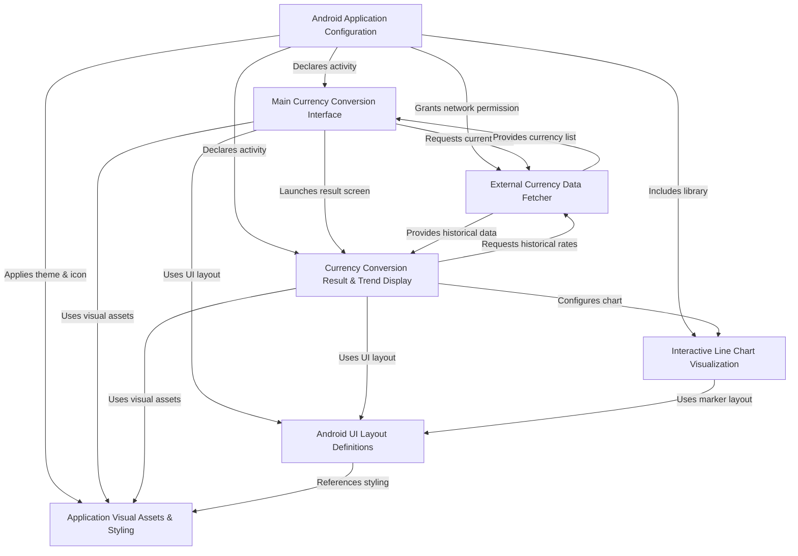
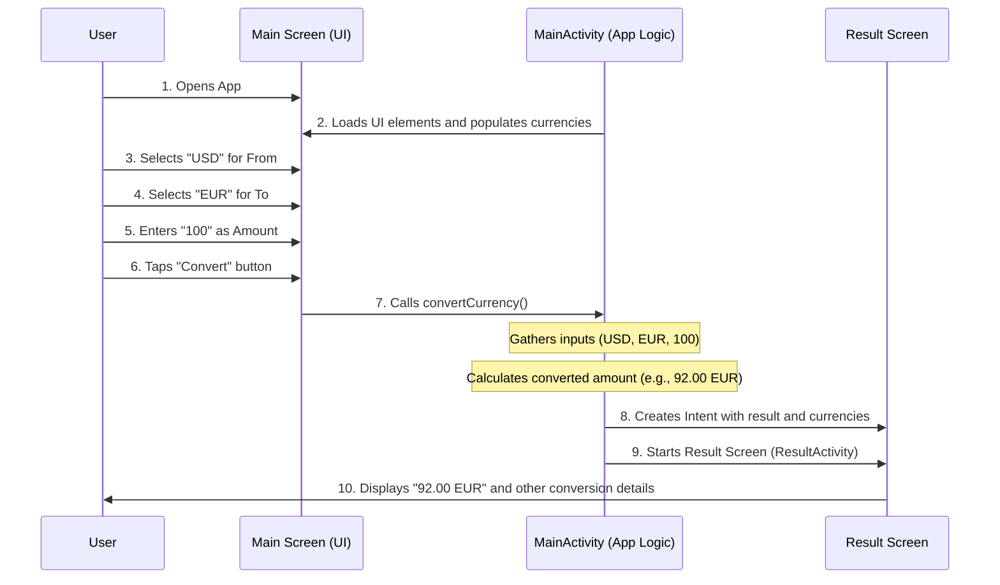
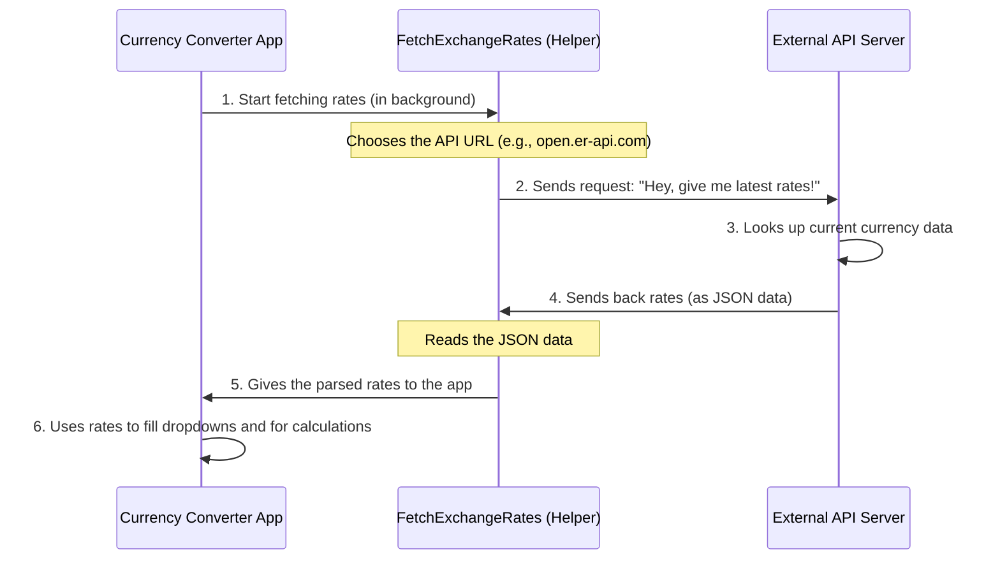
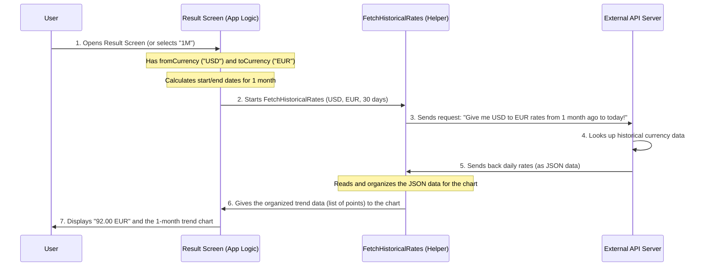
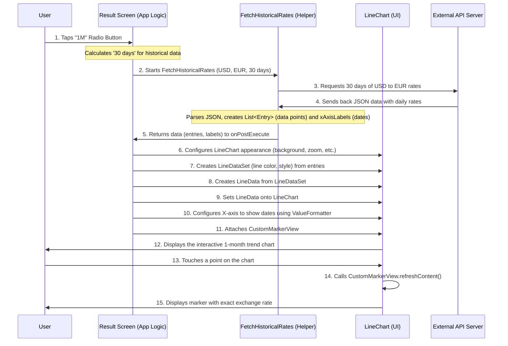
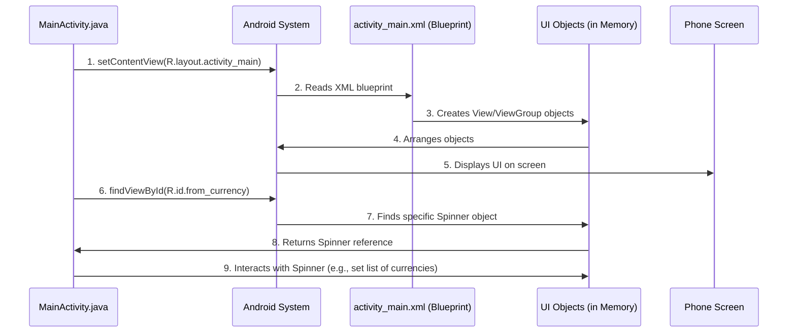
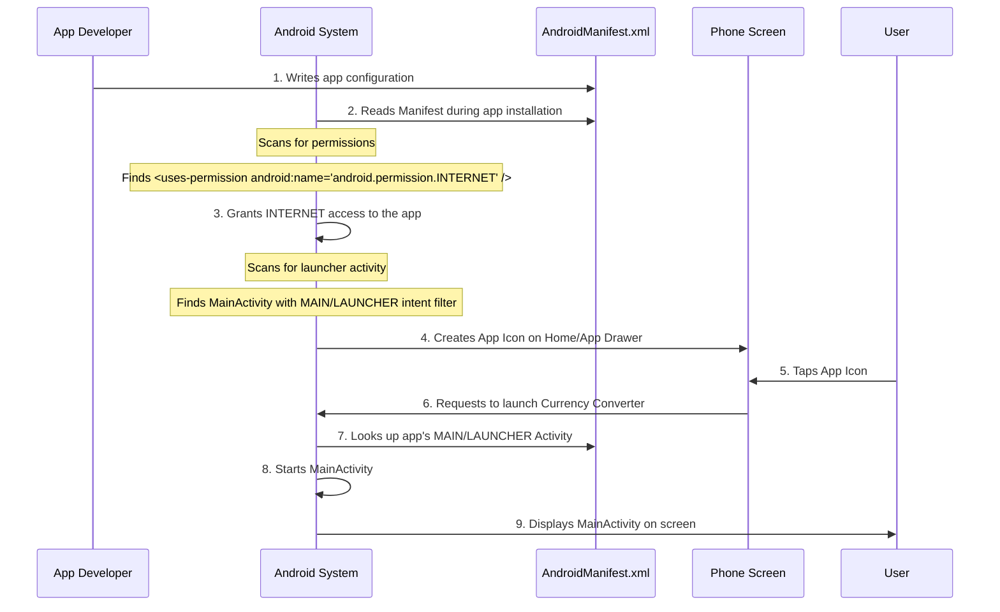

# Tutorial: Currency_Converter-Android-

This project is an **Android Currency Converter** application that helps users easily *convert amounts* between different currencies. It also provides a visual representation of *historical exchange rate trends* using interactive charts, allowing users to see currency fluctuations over various time periods.


## Visual Overview



## Chapters

1. [Main Currency Conversion Interface
](01_main_currency_conversion_interface_.md)
2. [External Currency Data Fetcher
](02_external_currency_data_fetcher_.md)
3. [Currency Conversion Result & Trend Display
](03_currency_conversion_result___trend_display_.md)
4. [Interactive Line Chart Visualization
](04_interactive_line_chart_visualization_.md)
5. [Android UI Layout Definitions
](05_android_ui_layout_definitions_.md)
6. [Application Visual Assets & Styling
](06_application_visual_assets___styling_.md)
7. [Android Application Configuration
](07_android_application_configuration_.md)

---

# Chapter 1: Main Currency Conversion Interface

Welcome to the first chapter of our tutorial for the `Currency_Converter-Android-` app! We're going to start our journey by understanding the very first thing you see and interact with when you open the app: the **Main Currency Conversion Interface**.

### What's the Big Idea?

Imagine you walk into a bank and want to exchange some money. You go to the main counter, tell the teller what currency you have, what currency you want, and how much you want to exchange. This is exactly what the "Main Currency Conversion Interface" in our app does!

It's the app's central hub, the primary screen where you, the user, tell the app:
1.  **Which currency you have** (e.g., US Dollars).
2.  **Which currency you want** (e.g., Euros).
3.  **How much money you want to convert** (e.g., 100).
4.  Then, you press a button to **make the conversion happen!**

Let's use a simple goal for this chapter: We want to understand how the app lets a user **convert 100 US Dollars (USD) into Euros (EUR)**.

### Getting to Know the Main Screen (The "Look and Feel")

Our Main Currency Conversion Interface is designed to be clear and easy to use. Think of it as a form you fill out to perform your currency exchange.

Let's look at the main parts you'll see on this screen, using simple examples from the app's design file (`app/src/main/res/layout/activity_main.xml`):

```xml
<LinearLayout ...>
    <ImageView ... android:src="@drawable/ic_logo" ... />
    <TextView ... android:text="Money Mapper" .../>
</LinearLayout>

<androidx.cardview.widget.CardView ...>
    <LinearLayout ...>
        <LinearLayout ...>
            <Spinner android:id="@+id/from_currency" .../>
            <ImageView android:id="@+id/swap_button" .../>
            <Spinner android:id="@+id/to_currency" .../>
        </LinearLayout>

        <com.google.android.material.textfield.TextInputLayout ...>
            <com.google.android.material.textfield.TextInputEditText
                android:id="@+id/amount_input" ... android:inputType="numberDecimal" />
        </com.google.android.material.textfield.TextInputLayout>

        <Button android:id="@+id/convert_button" ... android:text="Convert" .../>
    </LinearLayout>
</androidx.cardview.widget.CardView>
```

From this design, we can identify a few key interactive elements:

*   **App Title and Logo**: At the top, you'll see "Money Mapper" and a neat logo ([`ic_logo.xml`](app/src/main/res/drawable/ic_logo.xml)). This just tells you what app you're using.
*   **"From" Currency Selector** (`from_currency`): This is a dropdown menu (called a `Spinner` in Android) where you pick the currency you *currently have* (like USD).
*   **"To" Currency Selector** (`to_currency`): Another dropdown menu where you pick the currency you *want to convert to* (like EUR).
*   **Swap Button** (`swap_button`): A small icon (an `ImageView` showing an exchange symbol from [`ic_exchange.xml`](app/src/main/res/drawable/ic_exchange.xml)) that lets you quickly switch your "From" and "To" currency choices. Very handy!
*   **Amount Input** (`amount_input`): This is a text box (a `TextInputEditText`) where you type in the numerical amount you want to convert (like "100"). It's set up to only accept numbers with decimals.
*   **Convert Button** (`convert_button`): A big button you tap once you've made your selections and entered the amount. This kicks off the conversion process!

All these elements are nicely organized within a `CardView`, giving them a clean, elevated look against the app's background defined by [`gradient_background.xml`](app/src/main/res/drawable/gradient_background.xml).

### Bringing the Interface to Life (The "Behind the Scenes")

How do these visual parts actually work? Android apps connect what you see on the screen to the logic that runs the app. This connection typically happens in a file like `MainActivity.java`.

Here's how our app sets up and manages these interface elements:

#### 1. Connecting to the Screen Elements

First, the app needs to find the elements defined in the `activity_main.xml` file. It does this using special IDs (like `from_currency`, `to_currency`, etc.).

```java
// From: app/src/main/java/com/example/currencyconverter/MainActivity.java
public class MainActivity extends AppCompatActivity {
    private Spinner fromCurrency, toCurrency; // Declare variables
    private EditText amountInput;
    private Button convertButton;
    private ImageView swapButton;
    // ... other variables ...

    @Override
    protected void onCreate(Bundle savedInstanceState) {
        super.onCreate(savedInstanceState);
        setContentView(R.layout.activity_main); // Load the layout

        // Find and link the elements from the layout using their IDs
        fromCurrency = findViewById(R.id.from_currency);
        toCurrency = findViewById(R.id.to_currency);
        amountInput = findViewById(R.id.amount_input);
        convertButton = findViewById(R.id.convert_button);
        swapButton = findViewById(R.id.swap_button);
        // ... more setup ...
    }
    // ...
}
```
In this snippet, `findViewById()` is like giving the app a map and saying, "Hey, find the `Spinner` with the ID `from_currency` in our screen layout, and let's call it `fromCurrency` in our code."

#### 2. Preparing the Currency Choices

Before you can pick "USD" or "EUR," the app needs to know *all* the available currencies. Our app fetches this list from an external source using something called `FetchExchangeRates`. You'll learn more about this in [External Currency Data Fetcher](02_external_currency_data_fetcher_.md), but for now, just know it populates the `fromCurrency` and `toCurrency` dropdowns with a list of global currencies.

```java
// From: app/src/main/java/com/example/currencyconverter/MainActivity.java
// ... inside onPostExecute method of FetchExchangeRates ...
List<String> currencyList = new ArrayList<>();
Iterator<String> keys = exchangeRates.keys(); // Get currency names

while (keys.hasNext()) {
    currencyList.add(keys.next()); // Add each currency to the list
}

ArrayAdapter<String> adapter = new ArrayAdapter<>(MainActivity.this, android.R.layout.simple_spinner_item, currencyList);
adapter.setDropDownViewResource(android.R.layout.simple_spinner_dropdown_item);

fromCurrency.setAdapter(adapter); // Show currencies in "From" dropdown
toCurrency.setAdapter(adapter);   // Show currencies in "To" dropdown
// ...
```
This code takes the list of currencies (like USD, EUR, JPY) and makes them available for you to select in both dropdown menus.

#### 3. Handling User Actions

The app needs to react when you tap the "Swap" or "Convert" buttons. This is done using `setOnClickListener`.

```java
// From: app/src/main/java/com/example/currencyconverter/MainActivity.java
// ... inside onCreate method ...
convertButton.setOnClickListener(new View.OnClickListener() {
    @Override
    public void onClick(View v) {
        convertCurrency(); // Call our conversion function when 'Convert' is tapped
    }
});

swapButton.setOnClickListener(v -> {
    int fromPosition = fromCurrency.getSelectedItemPosition();
    int toPosition = toCurrency.getSelectedItemPosition();

    fromCurrency.setSelection(toPosition); // Set 'From' to 'To's currency
    toCurrency.setSelection(fromPosition); // Set 'To' to 'From's currency
});
// ...
```
*   When you tap the `swapButton`, the app simply switches whatever you've selected in the "From" and "To" dropdowns. It's like physically swapping two items!
*   When you tap the `convertButton`, the app calls a special function named `convertCurrency()` to do the actual work.

### How the Conversion Happens (Step-by-Step for "100 USD to EUR")

Let's trace our use case: converting 100 USD to EUR.

1.  **You (the User)**: Open the app.
2.  **Main Screen**: Shows "Money Mapper" and empty currency selectors.
3.  **App Logic**: Fetches currency rates in the background and populates the dropdowns.
4.  **You**: Tap the "From" currency selector, choose "USD".
5.  **You**: Tap the "To" currency selector, choose "EUR".
6.  **You**: Tap the "Amount" box, type "100".
7.  **You**: Tap the "Convert" button.

Now, the `convertCurrency()` function springs into action:

```java
// From: app/src/main/java/com/example/currencyconverter/MainActivity.java
private void convertCurrency() {
    try {
        // 1. Get user's choices
        String from = fromCurrency.getSelectedItem().toString(); // e.g., "USD"
        String to = toCurrency.getSelectedItem().toString();     // e.g., "EUR"
        String amountStr = amountInput.getText().toString();     // e.g., "100"

        // Basic check: Is the amount empty?
        if (amountStr.isEmpty()) {
            Toast.makeText(MainActivity.this, "Please enter an amount", Toast.LENGTH_SHORT).show();
            return;
        }

        double amount = Double.parseDouble(amountStr); // Convert "100" to a number

        // 2. Perform the calculation (details about `exchangeRates` are in the next chapter!)
        //    Let's assume `exchangeRates` tells us 1 USD = 0.92 EUR for this example.
        //    So, (100 / 1.0) * 0.92 = 92.00 EUR

        double fromRate = exchangeRates.getDouble(from); // Get USD rate (let's say 1.0)
        double toRate = exchangeRates.getDouble(to);     // Get EUR rate (let's say 0.92)
        double convertedAmount = (amount / fromRate) * toRate; // Calculate!

        String result = String.format("%.2f %s", convertedAmount, to); // Format as "92.00 EUR"

        // 3. Send the result to the next screen
        Intent intent = new Intent(MainActivity.this, ResultActivity.class);
        intent.putExtra("converted_amount", result); // Pass the final amount
        intent.putExtra("from_currency", from);     // Pass the 'from' currency
        intent.putExtra("to_currency", to);         // Pass the 'to' currency
        startActivity(intent); // Launch the next screen!

    } catch (NumberFormatException e) {
        Toast.makeText(MainActivity.this, "Invalid amount entered", Toast.LENGTH_SHORT).show();
    } catch (Exception e) {
        Log.e("Conversion Error", "Failed to convert currency", e);
        Toast.makeText(MainActivity.this, "Conversion failed", Toast.LENGTH_SHORT).show();
    }
}
```
This function first *gets* your selections and the amount. Then, it uses the currency rates (which are loaded by a different part of the app) to calculate the `convertedAmount`. Finally, instead of showing the result on the same screen, it packages the result and other details into an `Intent` and sends them to a *new screen* called `ResultActivity.class` to display everything neatly.

Here's a simplified sequence of events:



### Conclusion

In this chapter, we've explored the **Main Currency Conversion Interface** of our app. You've learned how it's designed to be the user's main point of interaction, allowing them to easily select currencies, input an amount, and initiate a conversion. We saw how the visual elements in `activity_main.xml` are connected to the app's code in `MainActivity.java` and how basic user interactions like swapping and converting are handled.

The key takeaway is that this screen is the "input station" where we gather all the necessary information before moving on to calculate and display the conversion. But where does the app get the actual exchange rates needed for this calculation? That's exactly what we'll explore in our next chapter!

[Next Chapter: External Currency Data Fetcher](02_external_currency_data_fetcher_.md)

---

# Chapter 2: External Currency Data Fetcher

Welcome back! In [Chapter 1: Main Currency Conversion Interface](01_main_currency_conversion_interface_.md), we learned about the buttons, input boxes, and dropdowns that make up our app's main screen. We saw how you, the user, tell the app what you want to convert (e.g., 100 USD to EUR) and then press "Convert."

But there's a big question: **How does the app know the *actual* exchange rate between USD and EUR?** Currencies change value all the time! It's not something we can hardcode into the app. This is where the **External Currency Data Fetcher** comes in!

### What's the Big Idea? (The App's Financial Analyst)

Imagine our app needs to know the latest exchange rate. It can't just guess! It needs a reliable source of information. This "External Currency Data Fetcher" is like the app's personal **financial analyst** or **researcher**. Its main job is to:

1.  **Go out and ask** for the most current and historical currency exchange rates.
2.  **Understand** the information it gets back.
3.  **Bring that information back** to the app in a usable format.

Without this component, our currency converter would be useless because it wouldn't know the real-world value of money! Both the main conversion (like 100 USD to EUR) and the trend chart (showing how rates changed over time, which we'll see in [Currency Conversion Result & Trend Display](03_currency_conversion_result___trend_display_.md)) rely entirely on this component to get accurate data.

Let's continue our use case: **converting 100 US Dollars (USD) into Euros (EUR)**. How does our app find the current rate for this?

### How Does it Work? (The Internet and APIs)

Our app gets its data from a special kind of online service called an **API** (Application Programming Interface). Think of an API like a **menu at a restaurant** or a **service desk**. You make a specific request (order from the menu), and the service provides you with exactly what you asked for.

Here are the key steps:

| Concept             | Analogy                           | What it means for our app                                     |
| :------------------ | :-------------------------------- | :------------------------------------------------------------ |
| **API**             | A restaurant menu/service desk    | A website (like `frankfurter.app`) that offers currency data. |
| **Making a Request**| Ordering from the menu            | Our app sends a specific message (HTTP request) to the API.   |
| **Receiving Data**  | Getting your food/receipt         | The API sends back information (JSON) to our app.             |
| **Parsing Data**    | Reading the recipe/receipt        | Our app reads and understands the JSON data.                  |

### Fetching Today's Exchange Rates

When you open the app, it needs to get all the current exchange rates to fill the "From" and "To" dropdown menus. This happens right away in `MainActivity.java` using a special helper called `FetchExchangeRates`.

```java
// From: app/src/main/java/com/example/currencyconverter/MainActivity.java
public class MainActivity extends AppCompatActivity {
    // ... other variables ...
    private JSONObject exchangeRates; // This will store all the rates

    @Override
    protected void onCreate(Bundle savedInstanceState) {
        super.onCreate(savedInstanceState);
        setContentView(R.layout.activity_main);
        // ... find views ...

        // This line kicks off the data fetching!
        new FetchExchangeRates().execute("https://open.er-api.com/v6/latest/USD");

        // ... set up button listeners ...
    }
    // ...
}
```
This single line `new FetchExchangeRates().execute(...)` is the magic. It tells the app: "Go fetch the latest currency rates from this web address!" The `exchangeRates` variable will hold all the data once it's downloaded.

### Under the Hood: The `FetchExchangeRates` Helper

Fetching data from the internet takes time. If our app tried to do this directly on the main screen, it would freeze up! To avoid this, Android provides `AsyncTask`, which lets us do work in the background. Our `FetchExchangeRates` is an `AsyncTask`.

Here's a simplified sequence of what happens when the app fetches currency data:



Let's look at the `FetchExchangeRates` helper in `MainActivity.java`:

#### 1. Making the Request (`doInBackground`)

This part runs "in the background" without freezing the app.

```java
// From: app/src/main/java/com/example/currencyconverter/MainActivity.java
private class FetchExchangeRates extends AsyncTask<String, Void, String> {
    @Override
    protected String doInBackground(String... urls) {
        try {
            // 1. Where to get the data? (Our API address)
            URL url = new URL(urls[0]); // e.g., "https://open.er-api.com/v6/latest/USD"
            // 2. Open a connection to that address
            HttpURLConnection connection = (HttpURLConnection) url.openConnection();
            connection.setRequestMethod("GET"); // We want to "GET" data

            // 3. Read the data that comes back
            BufferedReader reader = new BufferedReader(new InputStreamReader(connection.getInputStream()));
            StringBuilder response = new StringBuilder();
            String line;
            while ((line = reader.readLine()) != null) {
                response.append(line); // Keep adding lines until done
            }
            reader.close();
            return response.toString(); // Send the raw data back
        } catch (Exception e) {
            Log.e("API Error", "Failed to fetch exchange rates", e);
            return null; // Something went wrong
        }
    }
    // ... more code ...
}
```
*   `URL`: This is like writing down the web address of the API.
*   `HttpURLConnection`: This is how our app "talks" to the web address. We tell it we want to `GET` information.
*   `BufferedReader`: This helps us read the data (like a long string of text) that the API sends back.
*   `response.toString()`: All the raw data from the API is collected into one big text string and returned.

#### 2. Understanding the Data (`onPostExecute`)

Once `doInBackground` is done and has the raw data, `onPostExecute` runs back on the main screen. This part takes the raw data and makes it useful.

```java
// From: app/src/main/java/com/example/currencyconverter/MainActivity.java
// ... inside FetchExchangeRates class ...
    @Override
    protected void onPostExecute(String result) {
        if (result == null) {
            // Handle error, maybe show a message to the user
            return;
        }

        try {
            JSONObject jsonResponse = new JSONObject(result); // Raw text -> structured data
            exchangeRates = jsonResponse.getJSONObject("rates"); // Find the "rates" section

            List<String> currencyList = new ArrayList<>();
            Iterator<String> keys = exchangeRates.keys(); // Get all currency names (USD, EUR, etc.)

            while (keys.hasNext()) {
                currencyList.add(keys.next()); // Add each currency to our list
            }

            // Prepare the dropdown menus with the fetched currency names
            ArrayAdapter<String> adapter = new ArrayAdapter<>(MainActivity.this, android.R.layout.simple_spinner_item, currencyList);
            adapter.setDropDownViewResource(android.R.layout.simple_spinner_dropdown_item);
            fromCurrency.setAdapter(adapter); // Show currencies in "From" dropdown
            toCurrency.setAdapter(adapter);   // Show currencies in "To" dropdown
        } catch (Exception e) {
            Log.e("JSON Error", "Failed to parse API response", e);
            // Handle error
        }
    }
// ...
```
*   `JSONObject jsonResponse = new JSONObject(result);`: The raw text `result` is often in a format called **JSON** (JavaScript Object Notation). It's a way to organize data using `{ }` for objects and `[ ]` for lists. This line converts the text into a usable `JSONObject` that our app can understand.
    *   **Example JSON Snippet (simplified):**
        ```json
        {
          "base": "USD",
          "rates": {
            "EUR": 0.92,
            "JPY": 150.00,
            "GBP": 0.79
          }
        }
        ```
*   `exchangeRates = jsonResponse.getJSONObject("rates");`: From the full JSON, we're interested in the "rates" part. This line grabs that specific section, which contains all the individual currency rates (e.g., "EUR": 0.92).
*   `Iterator<String> keys = exchangeRates.keys();`: This helps us get all the names of the currencies (like "EUR", "JPY", "GBP") so we can add them to our dropdown menus.
*   `fromCurrency.setAdapter(adapter);` and `toCurrency.setAdapter(adapter);`: These lines take the list of currency names and display them in the "From" and "To" dropdowns on the main screen, ready for you to pick!

After these steps, the `exchangeRates` variable holds all the current conversion values, ready for the `convertCurrency()` function to use them, as we saw in Chapter 1.

### Essential Permission: Talking to the Internet

For our app to actually "talk" to the external API over the internet, Android requires a special permission. This is declared in the `AndroidManifest.xml` file:

```xml
<!-- From: app/src/main/AndroidManifest.xml -->
<manifest xmlns:android="http://schemas.android.com/apk/res/android"
    xmlns:tools="http://schemas.android.com/tools">

    <!-- This line allows the app to connect to the internet! -->
    <uses-permission android:name="android.permission.INTERNET" />

    <application
        <!-- ... other settings ... --> >
        <!-- ... activities ... -->
    </application>

</manifest>
```
Without `android.permission.INTERNET`, the app simply wouldn't be able to reach the currency API, and our "financial analyst" would be stuck at home!

### Conclusion

In this chapter, we've unveiled the secret behind how our currency converter gets its real-world data: the **External Currency Data Fetcher**. We learned that it's like the app's financial researcher, communicating with external web services (APIs) over the internet. Through `AsyncTask` and JSON parsing, our app intelligently fetches the latest exchange rates and makes them available for conversions and trend analysis. This crucial component ensures our app always provides accurate, up-to-date financial information.

Now that we understand how the app gets the conversion rates, how does it actually show you the result and visualize the trend? Let's find out in the next chapter!

[Next Chapter: Currency Conversion Result & Trend Display](03_currency_conversion_result___trend_display_.md)

---

# Chapter 3: Currency Conversion Result & Trend Display

Welcome back, future app developer! In [Chapter 1: Main Currency Conversion Interface](01_main_currency_conversion_interface_.md), we learned how to input our conversion request (like 100 USD to EUR). Then, in [Chapter 2: External Currency Data Fetcher](02_external_currency_data_fetcher_.md), we discovered how our app gets the actual, up-to-date exchange rates from the internet.

Now, after all that hard work, where does the magic happen where we actually *see* our converted money and understand how its value has changed over time? That's what the **Currency Conversion Result & Trend Display** is all about!

### What's the Big Idea? (Your Financial Report)

Imagine you've just swapped your 100 US Dollars for Euros. You want to see the final amount, right? But what if you also wanted to know if that was a good time to convert? Has the Euro been getting stronger or weaker against the Dollar recently?

This "Currency Conversion Result & Trend Display" is like your app's personal **financial report screen**. Its main jobs are to:

1.  **Clearly show the converted amount:** The final number you've been waiting for!
2.  **Visualize historical trends:** Display an interactive graph showing how the exchange rate has changed over different periods (like the last day, month, or year). This helps you understand the *trend* of your conversion.

Let's continue our use case: You successfully converted **100 US Dollars (USD) into Euros (EUR)**, and the app calculated it as **92.00 EUR**. Now, how does the app show you this result and its trend?

### The Result Screen: What You See

When you tap the "Convert" button on the main screen, the app doesn't just show a small message. It takes you to a whole new screen specifically designed to show your results. This screen is defined in `app/src/main/res/layout/activity_result.xml`.

Let's look at its main parts:

#### 1. Your Converted Amount

At the top, the app proudly displays your converted money.

```xml
<!-- From: app/src/main/res/layout/activity_result.xml -->
<TextView
    android:layout_width="wrap_content"
    android:layout_height="wrap_content"
    android:textSize="28sp"
    android:text="Converted Amount"
    android:textStyle="bold"
    android:textColor="@color/black"/>

<TextView
    android:id="@+id/result_text"
    android:layout_width="wrap_content"
    android:layout_height="wrap_content"
    android:textSize="24sp"
    android:text="Converted Amount"
    android:textStyle="bold"
    android:textColor="@color/black"/>
```
*   The first `TextView` is just a label.
*   The second `TextView` with `android:id="@+id/result_text"` is where your actual converted amount (e.g., "92.00 EUR") will appear.

#### 2. Time Frame Selectors

Right below the converted amount, you'll see a row of buttons. These let you choose how far back in time you want to see the currency trend.

```xml
<!-- From: app/src/main/res/layout/activity_result.xml -->
<RadioGroup
    android:id="@+id/time_filter_group"
    android:layout_width="wrap_content"
    android:layout_height="wrap_content"
    android:orientation="horizontal"
    android:layout_gravity="center"
    android:layout_marginTop="10dp"
    android:layout_marginBottom="7dp">

    <RadioButton android:id="@+id/rb_1d" android:text="1D" android:checked="true" android:textColor="@android:color/black" />
    <RadioButton android:id="@+id/rb_5d" android:text="5D" android:textColor="@android:color/black"/>
    <RadioButton android:id="@+id/rb_1m" android:text="1M" android:textColor="@android:color/black"/>
    <RadioButton android:id="@+id="rb_1y" android:text="1Y" android:textColor="@android:color/black"/>
    <RadioButton android:id="@+id/rb_5y" android:text="5Y" android:textColor="@android:color/black"/>
</RadioGroup>
```
*   `RadioGroup` holds several `RadioButton`s, ensuring that only one can be selected at a time.
*   Each `RadioButton` (like "1D" for 1 Day, "1M" for 1 Month) lets you pick a time frame for the chart. "1D" is checked by default.

#### 3. The Trend Chart

This is the star of the show! It's an interactive line chart that visually represents the historical exchange rates.

```xml
<!-- From: app/src/main/res/layout/activity_result.xml -->
<com.github.mikephil.charting.charts.LineChart
    android:id="@+id/line_chart"
    android:layout_width="match_parent"
    android:layout_height="390dp"
    android:layout_marginTop="20dp"
    android:background="@android:color/transparent"/>
```
*   `LineChart` is a special component that draws lines to show data changes over time. We'll dive deeper into how this chart works in [Interactive Line Chart Visualization](04_interactive_line_chart_visualization_.md).

#### 4. The "Go Back" Button

Simple and effective, this button takes you back to the main conversion screen.

```xml
<!-- From: app/src/main/res/layout/activity_result.xml -->
<Button
    android:id="@+id/back_button"
    android:layout_width="wrap_content"
    android:layout_height="wrap_content"
    android:text="Go Back"
    android:layout_marginTop="20dp"
    android:backgroundTint="@color/primary_color"
    android:textColor="@color/white"/>
```
*   This is a standard Android `Button` that, when tapped, will close this screen and return you to the previous one.

### Bringing the Result Screen to Life (`ResultActivity.java`)

Just like `MainActivity` handles the main screen, a file named `ResultActivity.java` (found in `app/src/main/java/com/example/currencyconverter/ResultActivity.java`) is responsible for this result and trend display screen.

#### 1. Getting the Conversion Details

Remember in Chapter 1, `MainActivity` sent an `Intent` with the converted amount and selected currencies to `ResultActivity`? Here's how `ResultActivity` receives and uses that information:

```java
// From: app/src/main/java/com/example/currencyconverter/ResultActivity.java
public class ResultActivity extends AppCompatActivity {
    private TextView resultText; // To show the converted amount
    private String fromCurrency; // Like "USD"
    private String toCurrency;   // Like "EUR"
    // ... other variables ...

    @Override
    protected void onCreate(Bundle savedInstanceState) {
        super.onCreate(savedInstanceState);
        setContentView(R.layout.activity_result); // Load our result screen layout

        // Find the elements from the layout
        resultText = findViewById(R.id.result_text);
        // ... find chart and radio group ...

        // Get values passed from MainActivity
        String convertedAmount = getIntent().getStringExtra("converted_amount"); // "92.00 EUR"
        fromCurrency = getIntent().getStringExtra("from_currency");             // "USD"
        toCurrency = getIntent().getStringExtra("to_currency");                 // "EUR"

        resultText.setText(convertedAmount); // Display "92.00 EUR"
        // ...
    }
    // ...
}
```
*   `getIntent().getStringExtra(...)` is like `ResultActivity` opening a package (`Intent`) and reading the labels inside it.
*   It grabs `convertedAmount` ("92.00 EUR") and sets it directly onto the `resultText` `TextView`.
*   It also stores the `fromCurrency` and `toCurrency` because these are crucial for fetching historical trend data.

#### 2. Handling Time Frame Selections

When you tap a radio button (like "1M"), the app needs to react and show the trend for that period.

```java
// From: app/src/main/java/com/example/currencyconverter/ResultActivity.java
// ... inside onCreate method ...
        // Fetch default data (7 days) when the screen first opens
        new FetchHistoricalRates().execute(fromCurrency, toCurrency, "7");

        // Listen for changes in our time filter buttons
        timeFilterGroup.setOnCheckedChangeListener((group, checkedId) -> {
            int days = 7; // Default to 7 days if nothing specific is chosen

            if (checkedId == R.id.rb_1d) {
                days = 2; // Fetch data for 2 days (minimum for a line)
            } else if (checkedId == R.id.rb_5d) {
                days = 5;
            } else if (checkedId == R.id.rb_1m) { // If "1M" (1 Month) is selected
                days = 30;
            } else if (checkedId == R.id.rb_1y) { // If "1Y" (1 Year) is selected
                days = 365;
            } else if (checkedId == R.id.rb_5y) { // If "5Y" (5 Years) is selected
                days = 1825;
            }

            // Start fetching historical rates for the newly selected time frame
            new FetchHistoricalRates().execute(fromCurrency, toCurrency, String.valueOf(days));
        });
// ...
```
*   `setOnCheckedChangeListener` waits for you to tap a radio button.
*   Based on which button you tap, it calculates the number of `days` needed for the historical data.
*   Then, it calls `new FetchHistoricalRates().execute(...)`, which is our special helper to get the *historical* data for the chosen time frame.

#### 3. Going Back to the Main Screen

This is straightforward:

```java
// From: app/src/main/java/com/example/currencyconverter/ResultActivity.java
// ... inside onCreate method ...
        Button backButton = findViewById(R.id.back_button);
        backButton.setOnClickListener(v -> finish()); // When tapped, close this screen
// ...
```
*   `finish()` is an Android command that simply closes the current screen (`ResultActivity`) and shows the previous one (`MainActivity`).

### Under the Hood: Fetching Historical Trends (`FetchHistoricalRates`)

Now, let's look at how the app gets all that historical data for the chart. It's very similar to how we fetched *current* rates in Chapter 2, but with a slight twist: we need data for a *range* of dates!

Here's the sequence of events when the app wants to display the USD to EUR trend for the last 1 month:



Let's dive into the `FetchHistoricalRates` class within `ResultActivity.java`.

#### 1. Making the Request (`doInBackground`)

This part runs in the background and gets the data from an API.

```java
// From: app/src/main/java/com/example/currencyconverter/ResultActivity.java
private class FetchHistoricalRates extends AsyncTask<String, Void, List<Entry>> {
    private List<String> xAxisLabels = new ArrayList<>(); // To store dates for the chart's X-axis

    @Override
    protected List<Entry> doInBackground(String... params) {
        List<Entry> entries = new ArrayList<>(); // This will hold the data points for the chart
        try {
            String from = params[0]; // e.g., "USD"
            String to = params[1];   // e.g., "EUR"
            int days = Integer.parseInt(params[2]); // e.g., 30 for 1 month

            // Calculate start and end dates
            Calendar cal = Calendar.getInstance();
            SimpleDateFormat sdf = new SimpleDateFormat("yyyy-MM-dd", Locale.getDefault());
            String endDate = sdf.format(cal.getTime()); // Today's date
            cal.add(Calendar.DAY_OF_MONTH, -days); // Go back X days
            String startDate = sdf.format(cal.getTime()); // Date X days ago

            // Construct the API URL for historical data
            String apiUrl = "https://api.frankfurter.app/" + startDate + ".." + endDate
                    + "?from=" + from + "&to=" + to;

            URL url = new URL(apiUrl);
            HttpURLConnection connection = (HttpURLConnection) url.openConnection();
            // ... (standard HTTP request code like in Chapter 2) ...

            // Parse the JSON response
            JSONObject jsonResponse = new JSONObject(response.toString());
            JSONObject rates = jsonResponse.getJSONObject("rates"); // Get the "rates" section

            List<String> dateKeys = new ArrayList<>();
            Iterator<String> keys = rates.keys();
            while (keys.hasNext()) {
                dateKeys.add(keys.next()); // Collect all the dates found in the rates
            }
            Collections.sort(dateKeys); // Sort dates so they appear in order on the chart

            int index = 0;
            for (String date : dateKeys) {
                // Get the exchange rate for the 'to' currency on this specific 'date'
                double value = rates.getJSONObject(date).getDouble(to);
                entries.add(new Entry(index++, (float) value)); // Add to chart data
                xAxisLabels.add(date); // Store the date for the chart's labels
            }

        } catch (Exception e) {
            Log.e("API Error", "Failed to fetch historical data", e);
        }
        return entries; // Return the list of data points
    }
    // ... more code ...
}
```
*   `Calendar` and `SimpleDateFormat`: These Java tools help us calculate the `startDate` and `endDate` needed for the API. For example, if today is Oct 30 and `days` is 30, `startDate` would be Sept 30.
*   `apiUrl`: Notice how the API URL is built with `startDate`, `endDate`, `from` currency, and `to` currency. This tells the Frankfurter API exactly what historical data we need.
*   `JSONObject rates = jsonResponse.getJSONObject("rates");`: The API returns a JSON structure containing daily rates. We extract the "rates" part.
    *   **Example JSON Snippet (simplified):**
        ```json
        {
          "base": "USD",
          "rates": {
            "2023-09-30": { "EUR": 0.93 },
            "2023-10-01": { "EUR": 0.92 },
            "2023-10-02": { "EUR": 0.925 }
          }
        }
        ```
*   `entries.add(new Entry(index++, (float) value));`: This is super important! `Entry` is what the chart library uses to draw points. `index` becomes the position on the chart (X-axis), and `value` is the actual exchange rate (Y-axis).
*   `xAxisLabels.add(date);`: We store the actual dates to display them clearly on the bottom of the chart.

#### 2. Displaying the Chart (`onPostExecute`)

Once `doInBackground` has prepared all the `Entry` data points, `onPostExecute` takes over to update the chart on the screen.

```java
// From: app/src/main/java/com/example/currencyconverter/ResultActivity.java
// ... inside FetchHistoricalRates class ...
    @Override
    protected void onPostExecute(List<Entry> entries) {
        if (entries.isEmpty()) {
            Toast.makeText(ResultActivity.this, "No data available", Toast.LENGTH_SHORT).show();
            return;
        }

        LineDataSet dataSet = new LineDataSet(entries, fromCurrency + " → " + toCurrency);
        // ... (styling for the line, like color, width, etc.) ...
        dataSet.setColor(Color.parseColor("#FF6D72")); // The line color
        dataSet.setDrawFilled(true); // Fill the area below the line

        LineData lineData = new LineData(dataSet); // Combine data into a LineData object
        lineChart.setData(lineData); // Give the data to our LineChart
        // ... (chart general styling like background, zoom, etc.) ...
        lineChart.setBackgroundColor(Color.BLACK);

        // Configure the X-axis to show our dates
        XAxis xAxis = lineChart.getXAxis();
        xAxis.setValueFormatter(new ValueFormatter() {
            @Override
            public String getAxisLabel(float value, com.github.mikephil.charting.components.AxisBase axis) {
                int index = (int) value;
                // Show the date corresponding to the data point's index
                return (index >= 0 && index < xAxisLabels.size()) ? xAxisLabels.get(index) : "";
            }
        });

        // Add a "marker" that shows the exact value when you touch the chart
        CustomMarkerView markerView = new CustomMarkerView(ResultActivity.this, R.layout.marker_view);
        markerView.setChartView(lineChart);
        lineChart.setMarker(markerView);

        lineChart.invalidate(); // Tell the chart to redraw itself with the new data
    }
}
```
*   `LineDataSet`: This holds the actual data points (`entries`) and defines how the line should look (color, thickness, etc.).
*   `lineChart.setData(lineData);`: This crucial line passes the prepared data to the `LineChart` component.
*   `xAxis.setValueFormatter(...)`: This is a clever way to make sure the chart's X-axis (the horizontal line at the bottom) displays actual dates like "2023-09-30" instead of just numbers (0, 1, 2...).
*   `CustomMarkerView`: This enhances user experience. When you tap or drag your finger on the chart, this small box appears to show the *exact* exchange rate value at that point in time. We'll explore charts and markers more in the next chapter.
*   `lineChart.invalidate();`: This command is like telling an artist, "Okay, here's all the new information, now paint it!" It forces the chart to redraw itself with the latest data.

### Conclusion

In this chapter, we explored the **Currency Conversion Result & Trend Display** screen. We saw how it takes the converted amount from the main screen and prominently displays it. More excitingly, we learned how it dynamically fetches and visualizes historical exchange rate trends using `FetchHistoricalRates` to communicate with a historical data API. This allows users to not only see their conversion result but also gain insights into how the rates have changed over time, thanks to the interactive chart and time frame selectors.

Ready to dive deeper into how that interactive chart works and how its visual elements are set up? Let's go!

[Next Chapter: Interactive Line Chart Visualization](04_interactive_line_chart_visualization_.md)

---

# Chapter 4: Interactive Line Chart Visualization

Welcome back, aspiring app developer! In [Chapter 3: Currency Conversion Result & Trend Display](03_currency_conversion_result___trend_display_.md), we saw how our app proudly shows the converted amount and hinted at an amazing interactive graph that visualizes currency trends. We even touched upon `FetchHistoricalRates` which gets the raw historical numbers.

Now, it's time to pull back the curtain and truly understand the **Interactive Line Chart Visualization**. This chapter is all about how those raw numbers from the internet are transformed into a beautiful, dynamic line graph that helps you see trends at a glance!

### What's the Big Idea? (Bringing Numbers to Life)

Imagine looking at a long list of numbers, like: "On October 1st, 1 USD = 0.92 EUR. On October 2nd, 1 USD = 0.925 EUR. On October 3rd, 1 USD = 0.918 EUR..." It's hard to quickly see if the Euro is getting stronger or weaker against the Dollar, isn't it?

The "Interactive Line Chart Visualization" solves this problem! It's like having a **visual storyteller** for your currency data. Instead of just numbers, you get a clear picture:

1.  **See the path**: A line that goes up and down, showing the currency's journey over time.
2.  **Spot trends**: Easily notice if the value is generally increasing, decreasing, or staying stable.
3.  **Get details**: Tap on the line to see the exact value on any given day.

Let's continue our use case: You converted **100 US Dollars (USD) into Euros (EUR)**. The chart's job is to show you how the USD-to-EUR exchange rate has changed over the last day, week, month, or year, helping you understand the history behind your conversion.

### The Chart's Drawing Tool: MPAndroidChart

Our app doesn't draw these complex graphs from scratch. It uses a powerful helper library called **MPAndroidChart**. Think of it as a specialized artist's toolkit for drawing charts on Android.

To use this toolkit, we first need to tell our project about it in the `app/build.gradle.kts` file:

```kotlin
// From: app/build.gradle.kts
dependencies {
    // ... other dependencies ...
    implementation("com.github.PhilJay:MPAndroidChart:v3.1.0") // This line adds the chart library!
    // ...
}
```
This single line downloads and includes all the necessary code for `MPAndroidChart`, making its features available to our app.

### Setting Up the Chart Canvas (`LineChart` in `activity_result.xml`)

Before drawing anything, we need a canvas! In our `activity_result.xml` layout, we reserve a space specifically for our line chart:

```xml
<!-- From: app/src/main/res/layout/activity_result.xml -->
<com.github.mikephil.charting.charts.LineChart
    android:id="@+id/line_chart"
    android:layout_width="match_parent"
    android:layout_height="390dp"
    android:layout_marginTop="20dp"
    android:background="@android:color/transparent"/>
```
*   `com.github.mikephil.charting.charts.LineChart`: This tells Android to put a chart here using the `MPAndroidChart` library.
*   `android:id="@+id/line_chart"`: Gives this chart a unique name so our code can find it.

### Bringing the Chart to Life (The `ResultActivity.java` Setup)

In `ResultActivity.java`, we manage the `LineChart`. When `FetchHistoricalRates` (from Chapter 3) finishes fetching data, it calls `onPostExecute` to update the chart.

Here's how we typically set up the chart's appearance:

```java
// From: app/src/main/java/com/example/currencyconverter/ResultActivity.java (inside onPostExecute)
// ...
            // Basic chart styling
            lineChart.setDrawGridBackground(false); // No grid lines behind the chart
            lineChart.getDescription().setEnabled(false); // No default description text
            lineChart.setTouchEnabled(true); // Allow touching the chart
            lineChart.setPinchZoom(true); // Allow zooming in/out with pinch gesture
            lineChart.setScaleEnabled(true); // Allow scaling the chart
            lineChart.setBackgroundColor(Color.BLACK); // Set the chart background color
// ...
```
*   These lines configure how the chart behaves and looks *before* any data is drawn. For example, `setTouchEnabled(true)` is what makes it interactive!

### Painting the Data: Entries, DataSets, and LineData

Now for the actual drawing! How do we tell the chart where to draw the line?

1.  **`Entry` (A Single Point)**: Each point on our line graph is an `Entry`. It has an X-value (its position along the bottom, like a day number) and a Y-value (the exchange rate for that day).

    ```java
    // From: app/src/main/java/com/example/currencyconverter/ResultActivity.java (inside doInBackground)
    // ...
    int index = 0; // Starts from 0 for the first day, then 1, 2, ...
    for (String date : dateKeys) {
        double value = rates.getJSONObject(date).getDouble(to); // Exchange rate for this date
        // Create an Entry: (X-position, Y-value)
        entries.add(new Entry(index++, (float) value)); // Add to our list of points
        xAxisLabels.add(date); // Keep the date to show later
    }
    // ...
    ```
    *   Here, `index` acts as the X-value (position on the horizontal axis), and `value` is the Y-value (the exchange rate). We store these `Entry` objects in a `List`.

2.  **`LineDataSet` (The Line Itself)**: A `LineDataSet` takes a list of `Entry` objects and defines how the line connecting them should look (color, thickness, filled area, etc.).

    ```java
    // From: app/src/main/java/com/example/currencyconverter/ResultActivity.java (inside onPostExecute)
    // ...
    LineDataSet dataSet = new LineDataSet(entries, fromCurrency + " → " + toCurrency);
    dataSet.setColor(Color.parseColor("#FF6D72")); // The color of the line
    dataSet.setLineWidth(2f); // How thick the line is
    dataSet.setDrawCircles(false); // Don't draw circles on each data point
    dataSet.setDrawValues(false); // Don't show the value text on each point
    dataSet.setMode(LineDataSet.Mode.CUBIC_BEZIER); // Make the line smooth
    dataSet.setDrawFilled(true); // Fill the area below the line
    dataSet.setFillColor(Color.parseColor("#FF6D72")); // Color for the filled area
    // ...
    ```
    *   This sets up the visual properties of our single line on the chart.

3.  **`LineData` (All the Lines)**: If you had multiple lines on one chart (e.g., USD to EUR, and USD to JPY), `LineData` would hold all those `LineDataSet` objects. For our app, we only have one line.

    ```java
    // From: app/src/main/java/com/example/currencyconverter/ResultActivity.java (inside onPostExecute)
    // ...
    LineData lineData = new LineData(dataSet); // Put our line data set into a LineData object
    lineChart.setData(lineData); // Give this data to the chart to draw!
    lineChart.invalidate(); // Tell the chart to redraw itself
    // ...
    ```
    *   `lineChart.setData(lineData)` is the magic moment where the chart receives all the prepared data and drawing instructions.
    *   `lineChart.invalidate()` tells the chart, "Hey, I've got new data, show it!"

### Labeling the Axes (Making Sense of the Chart)

A chart isn't useful without proper labels. We need to tell the user what the horizontal (X) and vertical (Y) axes represent.

#### The X-Axis (Dates)

Our X-axis shows dates. The `MPAndroidChart` library often uses numbers (0, 1, 2...) by default, so we need a special "formatter" to turn those numbers into actual dates like "2023-10-25".

```java
// From: app/src/main/java/com/example/currencyconverter/ResultActivity.java (inside onPostExecute)
// ...
            XAxis xAxis = lineChart.getXAxis();
            xAxis.setPosition(XAxis.XAxisPosition.BOTTOM); // Place labels at the bottom
            xAxis.setTextColor(Color.WHITE); // Color of the date labels
            xAxis.setDrawGridLines(false); // Don't draw vertical grid lines
            xAxis.setGranularity(1f); // Ensures labels appear at whole number intervals
            xAxis.setLabelCount(5, true); // Try to show around 5 labels, adjust as needed
            xAxis.setLabelRotationAngle(-45); // Rotate labels to fit more easily

            // This formatter converts the X-value (index) back to a date string
            xAxis.setValueFormatter(new ValueFormatter() {
                @Override
                public String getAxisLabel(float value, com.github.mikephil.charting.components.AxisBase axis) {
                    int index = (int) value;
                    // Look up the date we stored earlier using its index
                    return (index >= 0 && index < xAxisLabels.size()) ? xAxisLabels.get(index) : "";
                }
            });
// ...
```
*   `xAxis.setValueFormatter()` is the key here. It uses our `xAxisLabels` list (which stores the actual dates for each point) to display dates correctly.

#### The Y-Axis (Exchange Rate)

The Y-axis shows the currency exchange rate value. By default, `MPAndroidChart` often handles this well, but we can style it too.

```java
// From: app/src/main/java/com/example/currencyconverter/ResultActivity.java (inside onPostExecute)
// ...
            // Y-Axis (left side) styling
            lineChart.getAxisLeft().setTextColor(Color.WHITE); // Color of the rate labels
            lineChart.getAxisLeft().setDrawGridLines(true); // Draw horizontal grid lines
            lineChart.getAxisLeft().enableGridDashedLine(10f, 10f, 0f); // Make grid lines dashed
            lineChart.getAxisRight().setEnabled(false); // Hide the right Y-axis (we only need one)
// ...
```

### Interactive Detail: The Custom Marker View

When you touch a point on the chart, a small pop-up box appears, showing the exact exchange rate. This is called a **Marker View**.

#### 1. The Marker's Look (`marker_view.xml`)

First, we define how this little pop-up box should look:

```xml
<!-- From: app/src/main/res/layout/marker_view.xml -->
<LinearLayout xmlns:android="http://schemas.android.com/apk/res/android"
    android:layout_width="wrap_content"
    android:layout_height="wrap_content"
    android:orientation="vertical"
    android:background="@drawable/marker_bg"
    android:padding="6dp">

    <TextView
        android:id="@+id/tvContent"
        android:layout_width="wrap_content"
        android:layout_height="wrap_content"
        android:text="Value"
        android:textColor="@android:color/white"
        android:textStyle="bold"
        android:textSize="14sp" />
</LinearLayout>
```
*   `android:background="@drawable/marker_bg"`: Gives the pop-up a nice background (we'll see this `Drawable` in [Application Visual Assets & Styling](06_application_visual_assets___styling_.md)).
*   `TextView` with `id="@+id/tvContent"`: This is where the actual exchange rate value will be displayed.

#### 2. The Marker's Logic (`CustomMarkerView.java`)

Next, we have a special Java class that tells the chart *what* to put into that pop-up box.

```java
// From: app/src/main/java/com/example/currencyconverter/CustomMarkerView.java
package com.example.currencyconverter;

import android.content.Context;
import android.widget.TextView;
import com.github.mikephil.charting.components.MarkerView;
import com.github.mikephil.charting.data.Entry;
import com.github.mikephil.charting.highlight.Highlight;

public class CustomMarkerView extends MarkerView {
    private final TextView tvContent;

    public CustomMarkerView(Context context, int layoutResource) {
        super(context, layoutResource);
        tvContent = findViewById(R.id.tvContent); // Link to the TextView in marker_view.xml
    }

    @Override
    public void refreshContent(Entry e, Highlight highlight) {
        // When you touch a point, this method is called
        tvContent.setText(String.format("%.2f", e.getY())); // Show the Y-value (exchange rate)
        super.refreshContent(e, highlight);
    }
}
```
*   `refreshContent()`: This is the most important method here. `MPAndroidChart` calls this method when you touch a point. We take the `Entry` (`e`) of the touched point, get its `Y`-value (which is our exchange rate), format it nicely to two decimal places, and set it as the text for `tvContent`.

#### 3. Attaching the Marker to the Chart

Finally, we tell our `LineChart` to use this custom marker:

```java
// From: app/src/main/java/com/example/currencyconverter/ResultActivity.java (inside onPostExecute)
// ...
            CustomMarkerView markerView = new CustomMarkerView(ResultActivity.this, R.layout.marker_view);
            markerView.setChartView(lineChart); // Tell the marker which chart it belongs to
            lineChart.setMarker(markerView); // Give the chart our custom marker!
// ...
```
This sets up the "touch and see details" feature, making the chart truly interactive.

### Putting It All Together: The Charting Flow

Let's see how all these pieces work in sequence when you pick "1 Month" on the result screen:



### Conclusion

In this chapter, we explored the fascinating world of **Interactive Line Chart Visualization**. We learned how the powerful `MPAndroidChart` library acts as our drawing tool, transforming raw historical data into understandable visual trends. We saw how data points are prepared as `Entry` objects, styled into a `LineDataSet`, and then given to the `LineChart`. Crucially, we understood how `ValueFormatter` helps display meaningful dates on the X-axis and how a `CustomMarkerView` provides interactive details when you touch the chart.

This charting component is key to giving users a deep understanding of currency fluctuations, making our app truly insightful. Next, we'll shift our focus to the overall layout and design of our app's user interface, tying together how all these components fit into the visual structure.

[Next Chapter: Android UI Layout Definitions](05_android_ui_layout_definitions_.md)

---

# Chapter 5: Android UI Layout Definitions

Welcome back! In our previous chapter, [Interactive Line Chart Visualization](04_interactive_line_chart_visualization_.md), we learned how our app draws a dynamic line chart to show currency trends. We saw how data comes to life visually. But how do we decide *where* that chart appears on the screen? And how is it positioned next to other elements like buttons and text? This is where **Android UI Layout Definitions** come into play!

### What's the Big Idea? (The App's Blueprint)

Imagine you're building a house. You wouldn't just throw bricks and windows anywhere, right? You'd have a detailed blueprint that shows where each room goes, where the doors and windows are placed, and how everything connects.

In Android, our app screens (like the main conversion screen or the result screen) are like rooms in a house. The **Android UI Layout Definitions** are the **blueprints** for these screens. They are special XML files that tell Android:

1.  **What visual elements to display:** Buttons, text, input fields, images, charts, etc.
2.  **Where each element should be positioned:** Top, bottom, left, right, in the middle, or relative to another element.
3.  **How big each element should be:** Wide as the screen, just big enough for its content, or a specific size.
4.  **How elements are grouped and arranged:** In a line, or by aligning them to each other.

Without these layout definitions, Android wouldn't know how to draw your app on the screen, and you'd just see a blank space! Both our main conversion screen and our result screen rely heavily on these XML files to organize everything nicely.

Let's look at how our app uses these blueprints to build its screens, focusing on the `activity_main.xml` and `activity_result.xml` files.

### The Building Blocks: Views and ViewGroups

In Android, everything you see on the screen is a `View`, or a container that holds `Views` (a `ViewGroup`).

| Concept   | Analogy                                   | What it means for our app                                     | Examples from our app                      |
| :-------- | :---------------------------------------- | :------------------------------------------------------------ | :----------------------------------------- |
| **View**  | A single piece of furniture or a brick    | An individual user interface element that you can see or interact with. | `TextView`, `Button`, `Spinner`, `ImageView`, `LineChart`, `TextInputEditText` |
| **ViewGroup** | A room, a shelf, or a wall                | A special `View` that acts as a container to hold and arrange other `Views` (and even other `ViewGroups`). | `LinearLayout`, `ConstraintLayout`, `CardView`, `RadioGroup` |

Essentially, `ViewGroups` are like layout managers, deciding how their child `Views` are organized.

### Essential Blueprint Details: Attributes

Each `View` or `ViewGroup` in our XML blueprint has **attributes**. These are like notes on the blueprint that describe the element's properties. All attributes start with `android:` (or `app:` for special ones).

Here are some common ones you'll see:

*   **`android:id="@+id/some_name"`**: Gives a unique name to an element, so our Java code can find and control it. Think of it as a house number for each piece of furniture.
*   **`android:layout_width="match_parent"`** or **`"wrap_content"`** or **`"100dp"`**: How wide the element should be.
    *   `"match_parent"`: Make it as wide as its parent container.
    *   `"wrap_content"`: Make it just wide enough to fit its content (text, image, etc.).
    *   `"100dp"`: Make it exactly 100 density-independent pixels wide (a consistent unit across different screen sizes).
*   **`android:layout_height="..."`**: Similar to `layout_width`, but for height.
*   **`android:text="Some Text"`**: What text a `TextView` or `Button` should display.
*   **`android:src="@drawable/ic_logo"`**: For an `ImageView`, this specifies which image to display.
*   **`android:orientation="vertical"`** or **`"horizontal"`**: Used by `LinearLayout` to arrange its children.
*   **`android:padding="16dp"`**: Adds empty space *inside* the element.
*   **`android:layout_margin="16dp"`**: Adds empty space *outside* the element, pushing it away from other elements.

### Common Layout Types (ViewGroups) in Our App

Our app uses a few main `ViewGroups` to organize its screens:

1.  **`LinearLayout`**:
    *   **Idea**: Arranges its children in a single line, either vertically (one on top of the other) or horizontally (side by side).
    *   **When to use**: Good for simple rows or columns of items, like a list or a header section.
    *   **Example from our app**: The title section (logo and app name) on the main screen, and the currency selectors (From Spinner, Swap Button, To Spinner).
    ```xml
    <!-- From: app/src/main/res/layout/activity_main.xml -->
    <LinearLayout
        android:layout_width="wrap_content"
        android:layout_height="wrap_content"
        android:orientation="horizontal" <!-- Arranges children side-by-side -->
        android:gravity="center_vertical">

        <ImageView ... /> <!-- App Logo -->
        <TextView ... android:text="Money Mapper" .../>
    </LinearLayout>
    ```

2.  **`ConstraintLayout`**:
    *   **Idea**: A very flexible layout that lets you position and size `Views` based on relationships (constraints) to other `Views` or to the parent layout. You can say "this button should be to the right of that text" or "this image should be centered horizontally."
    *   **When to use**: Excellent for complex UIs because it reduces the need for nested `ViewGroups`, which can improve performance.
    *   **Example from our app**: The main layout for `activity_main.xml`. Notice `app:layout_constraintTop_toTopOf="parent"`.
    ```xml
    <!-- From: app/src/main/res/layout/activity_main.xml -->
    <androidx.constraintlayout.widget.ConstraintLayout
        android:layout_width="match_parent"
        android:layout_height="match_parent"
        android:background="@drawable/gradient_background">

        <LinearLayout
            android:id="@+id/title_section"
            android:layout_width="wrap_content"
            android:layout_height="wrap_content"
            app:layout_constraintTop_toTopOf="parent"       <!-- Aligns top of title to top of parent -->
            app:layout_constraintStart_toStartOf="parent" <!-- Aligns start of title to start of parent -->
            app:layout_constraintEnd_toEndOf="parent">     <!-- Aligns end of title to end of parent (centers it) -->
            <!-- ... content of title_section ... -->
        </LinearLayout>

        <!-- Other elements like CardView are also positioned using constraints -->
        <androidx.cardview.widget.CardView
            app:layout_constraintTop_toBottomOf="@id/title_section" <!-- Aligns top of card below title -->
            <!-- ... -->
        </androidx.cardview.widget.CardView>
    </androidx.constraintlayout.widget.ConstraintLayout>
    ```

3.  **`CardView`**:
    *   **Idea**: A special layout that presents content inside a card-like container with rounded corners and a shadow, giving it an elevated, modern look.
    *   **When to use**: To group related content and make it stand out.
    *   **Example from our app**: The main input area on `activity_main.xml`.
    ```xml
    <!-- From: app/src/main/res/layout/activity_main.xml -->
    <androidx.cardview.widget.CardView
        android:layout_width="match_parent"
        android:layout_height="wrap_content"
        app:cardCornerRadius="16dp" <!-- Rounded corners -->
        app:cardElevation="6dp"    <!-- Shadow effect -->
        app:cardBackgroundColor="@color/white">

        <LinearLayout android:orientation="vertical">
            <!-- This LinearLayout holds the Spinners, Input, and Button -->
        </LinearLayout>
    </androidx.cardview.widget.CardView>
    ```

4.  **`RadioGroup`**:
    *   **Idea**: A `ViewGroup` specifically designed to hold `RadioButton` elements. When `RadioButton`s are inside a `RadioGroup`, only one can be selected at a time, like a multiple-choice question.
    *   **When to use**: When you need to provide mutually exclusive options.
    *   **Example from our app**: The time filter buttons (1D, 5D, 1M, etc.) on the result screen.
    ```xml
    <!-- From: app/src/main/res/layout/activity_result.xml -->
    <RadioGroup
        android:id="@+id/time_filter_group"
        android:layout_width="wrap_content"
        android:layout_height="wrap_content"
        android:orientation="horizontal"> <!-- Arranges radio buttons side-by-side -->

        <RadioButton android:id="@+id/rb_1d" android:text="1D" ... />
        <RadioButton android:id="@+id/rb_5d" android:text="5D" ... />
        <!-- ... more RadioButtons ... -->
    </RadioGroup>
    ```

### How Our App Uses Layouts: A Closer Look

Let's see how our `activity_main.xml` and `activity_result.xml` files combine these building blocks to create the user interface.

#### 1. The Main Conversion Screen (`activity_main.xml`)

This layout defines the screen where you enter amounts and select currencies.

```xml
<!-- A simplified view of app/src/main/res/layout/activity_main.xml -->
<androidx.constraintlayout.widget.ConstraintLayout
    android:layout_width="match_parent"
    android:layout_height="match_parent">

    <LinearLayout android:id="@+id/title_section">
        <ImageView android:src="@drawable/ic_logo" ... />
        <TextView android:text="Money Mapper" .../>
    </LinearLayout>

    <androidx.cardview.widget.CardView>
        <LinearLayout android:orientation="vertical">
            <LinearLayout> <!-- Holds From Spinner, Swap Button, To Spinner -->
                <Spinner android:id="@+id/from_currency" .../>
                <ImageView android:id="@+id/swap_button" .../>
                <Spinner android:id="@+id/to_currency" .../>
            </LinearLayout>

            <com.google.android.material.textfield.TextInputLayout>
                <com.google.android.material.textfield.TextInputEditText
                    android:id="@+id/amount_input" ... />
            </com.google.android.material.textfield.TextInputLayout>

            <Button android:id="@+id/convert_button" .../>
        </LinearLayout>
    </androidx.cardview.widget.CardView>
</androidx.constraintlayout.widget.ConstraintLayout>
```
*   The entire screen is managed by a `ConstraintLayout`, allowing us to position the `title_section` (a `LinearLayout` containing the logo and text) and the `CardView` (which holds all the input fields) relative to each other and the screen edges.
*   Inside the `CardView`, a `LinearLayout` stacks the currency selectors, amount input, and convert button vertically.
*   Another `LinearLayout` (nested inside the card's `LinearLayout`) arranges the `from_currency` `Spinner`, `swap_button` `ImageView`, and `to_currency` `Spinner` horizontally side-by-side.

#### 2. The Result and Trend Screen (`activity_result.xml`)

This layout defines the screen that shows your converted amount and the historical trend chart.

```xml
<!-- A simplified view of app/src/main/res/layout/activity_result.xml -->
<LinearLayout
    android:layout_width="match_parent"
    android:layout_height="match_parent"
    android:orientation="vertical"
    android:gravity="center">

    <TextView android:text="Converted Amount" .../>
    <TextView android:id="@+id/result_text" .../>

    <RadioGroup android:id="@+id/time_filter_group" android:orientation="horizontal">
        <RadioButton android:id="@+id/rb_1d" .../>
        <RadioButton android:id="@+id/rb_5d" .../>
        <!-- ... more RadioButtons ... -->
    </RadioGroup>

    <com.github.mikephil.charting.charts.LineChart
        android:id="@+id/line_chart" .../>

    <Button android:id="@+id/back_button" .../>
</LinearLayout>
```
*   Here, a simple `LinearLayout` stacks everything vertically, centered on the screen.
*   We have `TextView`s to display the converted value.
*   A `RadioGroup` arranges the `RadioButton`s (for 1D, 1M, 1Y filters) horizontally.
*   The `LineChart` (our specialized `View` from the charting library) takes up a large portion of the screen, and finally, a `Button` to go back.

### Under the Hood: Android's Layout Process ("Inflation")

How does Android take these XML blueprints and actually draw them on your phone's screen?

1.  **XML is a Blueprint**: The XML files like `activity_main.xml` are just text files. They describe the structure, but they aren't actual interactive elements yet.
2.  **Activity Starts**: When you launch `MainActivity`, it tells Android, "Hey, load the UI defined in `activity_main.xml` for me!" It does this with `setContentView(R.layout.activity_main);`.
3.  **Layout Inflation**: Android's system (the "Layout Inflater") reads the XML file. It goes through each `<tag>` (like `<LinearLayout>`, `<TextView>`, `<Button>`) and creates a corresponding Java object for it in memory. It also sets all the attributes (like `layout_width`, `text`, `id`) on these objects. This process is called **inflation**.
4.  **Display on Screen**: Once all the `View` and `ViewGroup` objects are created and arranged according to the XML, Android then draws them onto the device's screen.
5.  **Connecting Code to UI**: Our Java code (e.g., in `MainActivity.java` or `ResultActivity.java`) then uses `findViewById(R.id.some_id)` to get a reference to these newly created UI objects. This allows our code to interact with them, like setting text, listening for button taps, or updating the chart.

Here's a simplified sequence of how this works:


This process ensures that your app's visual elements are correctly laid out and ready for your code to control them.

### Conclusion

In this chapter, we've explored **Android UI Layout Definitions**, which are the essential XML blueprints for building our app's user interface. We learned about `Views` (individual elements) and `ViewGroups` (containers that arrange elements), along with common attributes that define their properties. We looked at `LinearLayout`, `ConstraintLayout`, `CardView`, and `RadioGroup` as key ways to structure our screens, using examples from `activity_main.xml` and `activity_result.xml`. Finally, we understood how Android "inflates" these XML blueprints into real UI objects and how our Java code connects to them.

Now that we know how to define the structure of our app's UI, what about making it look good with colors, fonts, and images? That's what we'll explore in the next chapter!

[Next Chapter: Application Visual Assets & Styling](06_application_visual_assets___styling_.md)

---

# Chapter 6: Application Visual Assets & Styling

Welcome back! In [Chapter 5: Android UI Layout Definitions](05_android_ui_layout_definitions_.md), we learned how to arrange all the pieces of our app's interface using XML blueprints. We figured out where the buttons, text boxes, and charts should sit on the screen.

Now, imagine you've built a perfectly functional house, but all the walls are bare, the furniture is plain, and there are no decorations. It works, but it doesn't look inviting! This is where **Application Visual Assets & Styling** comes in.

### What's the Big Idea? (The App's Interior Design)

This concept is all about giving our app its unique look and feel. It's like being an **interior designer** for your app, choosing:
1.  **Color palettes:** What colors to paint the walls, choose for curtains, or highlight special features.
2.  **Themes:** The overall mood or style – bright and airy (light mode) or cozy and muted (dark mode).
3.  **Text styles:** The fonts, sizes, and colors for all the words.
4.  **Decorative elements (Drawables):** Unique images, patterns for backgrounds, custom shapes for buttons or borders.

These choices make the app appealing, easy to read, and give it a professional touch. Our goal is to understand how our `Currency_Converter-Android-` app uses these visual assets to make its main conversion screen and result screen look polished and user-friendly.

Let's explore the tools Android gives us to manage these visual elements. They are all typically found in the `app/src/main/res/` folder, organized into different subfolders like `values/` (for colors, strings, themes) and `drawable/` (for images and shapes).

### Your App's Toolbox for Style

#### 1. Colors: Your App's Paint Palette (`values/colors.xml`)

This file is like your app's main paint palette. Instead of typing color codes everywhere (like `#FF0000` for red), you define names for your colors once, making it easy to keep your app consistent.

```xml
<!-- From: app/src/main/res/values/colors.xml -->
<?xml version="1.0" encoding="utf-8"?>
<resources>
    <color name="primary_color">#BC9012</color>
    <color name="black">#FF000000</color>
    <color name="white">#FFFFFFFF</color>
    <color name="transparent">#00000000</color>
    <!-- ... other colors ... -->
</resources>
```
*   Each `<color>` tag defines a color with a `name` and a hexadecimal color code (like `#BC9012`).
*   **How it's used:** When we define a button or text in our layout XML, we can reference these colors:
    ```xml
    <!-- Example from an XML layout file -->
    <TextView
        android:layout_width="wrap_content"
        android:layout_height="wrap_content"
        android:textColor="@color/black" <!-- Uses the 'black' color from colors.xml -->
        android:textStyle="bold"/>
    ```
    This makes it easy to change your app's branding later by just updating `colors.xml`.

#### 2. Text: Your App's Vocabulary (`values/strings.xml`)

This file holds all the text that your app displays. It's a central place for words, ensuring consistency and making it easier to translate your app into different languages later.

```xml
<!-- From: app/src/main/res/values/strings.xml -->
<resources>
    <string name="app_name">currencyconverter</string>
    <!-- ... other strings ... -->
</resources>
```
*   Each `<string>` tag defines a piece of text with a `name` and its content.
*   **How it's used:** In our layout XML files, instead of typing the text directly, we reference these strings:
    ```xml
    <!-- Example from an XML layout file -->
    <TextView
        android:layout_width="wrap_content"
        android:layout_height="wrap_content"
        android:text="@string/app_name" <!-- Uses the 'app_name' string -->
        android:textSize="24sp"/>
    ```
    If you ever want to change the app's name, you just change `strings.xml`, and it updates everywhere.

#### 3. Drawables: Your App's Decorations (`drawable/` folder)

Drawables are reusable visual assets like icons, background images, or custom shapes. They live in the `drawable/` folder.

##### a. Icons (Vector Graphics)

These are like smart images. Instead of being made of pixels (which can look blurry when scaled), they are defined by mathematical paths, so they look crisp on any screen size.

```xml
<!-- From: app/src/main/res/drawable/ic_logo.xml (simplified) -->
<vector xmlns:android="http://schemas.android.com/apk/res/android"
    android:width="24dp"
    android:height="24dp"
    android:viewportWidth="512"
    android:viewportHeight="512">
    <!-- Defines parts of the logo using paths and colors -->
    <path android:fillColor="#294267" android:pathData="M245.5,201.5C243.06,201.68 ..."/>
    <path android:fillColor="#71bbee" android:pathData="M192.5,110.5C243.17,109.83 ..."/>
    <!-- ... more path elements for the full logo ... -->
</vector>
```
*   `<vector>` is the main tag for vector assets.
*   `<path>` defines shapes using coordinates and curves, with `android:fillColor` for their color.
*   **How it's used:** You've seen these icons in [Chapter 1: Main Currency Conversion Interface](01_main_currency_conversion_interface_.md) for the app logo and swap button:
    ```xml
    <!-- Example from activity_main.xml -->
    <ImageView ... android:src="@drawable/ic_logo" ... />
    <ImageView android:id="@+id/swap_button" ... android:src="@drawable/ic_exchange" ... />
    ```

##### b. Backgrounds & Custom Shapes (XML Drawables)

You can also define backgrounds and custom shapes using XML, making them dynamic and reusable.

*   **Gradient Background (`gradient_background.xml`)**
    This creates a smooth color transition for our app's main background.

    ```xml
    <!-- From: app/src/main/res/drawable/gradient_background.xml -->
    <layer-list xmlns:android="http://schemas.android.com/apk/res/android">
        <item>
            <shape android:shape="rectangle">
                <gradient
                    android:angle="45"
                    android:startColor="#FFF08D"
                    android:endColor="#ECCF42"
                    android:type="radial"/>
            </shape>
        </item>
    </layer-list>
    ```
    *   `<gradient>` creates the color blend, defining `startColor`, `endColor`, and `angle`.
    *   **How it's used:** Applied to the main `ConstraintLayout` in `activity_main.xml`:
        ```xml
        <!-- Example from activity_main.xml -->
        <androidx.constraintlayout.widget.ConstraintLayout
            android:layout_width="match_parent"
            android:layout_height="match_parent"
            android:background="@drawable/gradient_background"> <!-- Our beautiful background! -->
            <!-- ... -->
        </androidx.constraintlayout.widget.ConstraintLayout>
        ```

*   **Spinner Background (`spinner_background.xml`)**
    This gives our currency dropdown menus a nice, consistent border and background.

    ```xml
    <!-- From: app/src/main/res/drawable/spinner_background.xml -->
    <shape xmlns:android="http://schemas.android.com/apk/res/android"
        android:shape="rectangle">
        <corners android:radius="8dp"/>
        <solid android:color="@android:color/white"/>
        <stroke android:width="1dp" android:color="@android:color/black"/>
    </shape>
    ```
    *   `<shape>` defines a geometric shape (here, a `rectangle`).
    *   `<corners>` makes the corners rounded.
    *   `<solid>` fills the shape with a color.
    *   `<stroke>` adds a border line.

*   **Chart Marker Background (`marker_bg.xml`)**
    Remember the small pop-up that shows the exact value when you tap the chart in [Chapter 4: Interactive Line Chart Visualization](04_interactive_line_chart_visualization_.md)? This file defines its look.

    ```xml
    <!-- From: app/src/main/res/drawable/marker_bg.xml -->
    <shape xmlns:android="http://schemas.android.com/apk/res/android"
        android:shape="rectangle">
        <solid android:color="#CC000000"/> <!-- Semi-transparent black -->
        <corners android:radius="8dp"/>
    </shape>
    ```
    This simply creates a rectangle with rounded corners and a semi-transparent black fill.

#### 4. Themes: Your App's Overall Look (`values/themes.xml` and `values-night/themes.xml`)

Themes define the overall look of your entire app or specific parts of it. They specify default colors, font styles, and other visual properties, often based on a "parent" theme provided by Android (like `Material3`).

Our app supports both a light and a dark mode, which is handled by having two `themes.xml` files: one in `values/` (for light mode) and one in `values-night/` (for dark mode). Android automatically picks the right one based on your phone's settings.

```xml
<!-- From: app/src/main/res/values/themes.xml (Light Mode) -->
<resources xmlns:tools="http://schemas.android.com/tools">
    <!-- Base application theme. -->
    <style name="Base.Theme.Currencyconverter" parent="Theme.Material3.DayNight.NoActionBar">
        <!-- Customize your light theme here. -->
        <!-- <item name="colorPrimary">@color/my_light_primary</item> -->
    </style>

    <style name="Theme.Currencyconverter" parent="Base.Theme.Currencyconverter" />
</resources>
```

```xml
<!-- From: app/src/main/res/values-night/themes.xml (Dark Mode) -->
<resources xmlns:tools="http://schemas.android.com/tools">
    <!-- Base application theme. -->
    <style name="Base.Theme.Currencyconverter" parent="Theme.Material3.DayNight.NoActionBar">
        <!-- Customize your dark theme here. -->
        <!-- <item name="colorPrimary">@color/my_dark_primary</item> -->
    </style>
</resources>
```
*   `<style>` defines a theme with a `name`.
*   `parent="Theme.Material3.DayNight.NoActionBar"`: This tells Android to inherit a lot of default styling from Google's Material Design 3 system, which automatically handles light and dark modes (`DayNight`) and removes the default action bar (`NoActionBar`).
*   You can then *customize* specific parts of the theme by adding `<item>` tags (e.g., setting a `colorPrimary`). Our app uses the defaults provided by `Material3` for simplicity.
*   **How it's used:** In your `AndroidManifest.xml` (which we'll cover in [Chapter 7: Android Application Configuration](07_android_application_configuration_.md)), you tell the entire app which theme to use. This makes all your UI elements (buttons, text fields, etc.) automatically adopt the theme's defined styles.

### How Android Puts It All Together

When your app starts, Android's system takes your XML layout definitions (from [Chapter 5: Android UI Layout Definitions](05_android_ui_layout_definitions_.md)) and combines them with all these visual assets and styling rules.

```mermaid
graph TD
    A[XML Layouts (activity_main.xml)] --> B[Android System]
    C[Colors (colors.xml)] --> B
    D[Strings (strings.xml)] --> B
    E[Drawables (ic_logo.xml, gradient_background.xml)] --> B
    F[Themes (themes.xml)] --> B
    B --> G[Final App UI on Screen]

    style A fill:#ADD8E6,stroke:#333,stroke-width:2px
    style C fill:#FFDDC1,stroke:#333,stroke-width:2px
    style D fill:#C1FFDDC1,stroke:#333,stroke-width:2px
    style E fill:#D1FFDDC1,stroke:#333,stroke-width:2px
    style F fill:#E1FFDDC1,stroke:#333,stroke-width:2px
    style G fill:#90EE90,stroke:#333,stroke-width:2px
```

*   The `Android System` acts like a conductor. It reads your UI blueprints (`XML Layouts`).
*   Whenever a layout needs a color, text, or image, it looks it up in `colors.xml`, `strings.xml`, or the `drawable` folder.
*   The `Themes` provide the overarching style guide for all components.
*   Finally, the system draws everything onto the `Phone Screen`, creating the beautiful and functional user interface you interact with.

This organized approach means your app's visual identity is consistent, easily maintainable, and adaptable (like supporting dark mode) without having to manually change every single UI element.

### Conclusion

In this chapter, we've explored **Application Visual Assets & Styling**, which are crucial for giving our app its unique and polished look. We learned about:
*   **`colors.xml`** for defining a reusable paint palette.
*   **`strings.xml`** for centralizing all app text.
*   The **`drawable/` folder** for housing vector icons (`ic_logo.xml`, `ic_exchange.xml`) and custom XML shapes (`gradient_background.xml`, `spinner_background.xml`, `marker_bg.xml`).
*   **`themes.xml`** for setting the app's overall style, including support for light and dark modes.

Understanding these resources helps us appreciate how Android apps achieve a professional and consistent user experience. We've laid out the structural (layouts) and visual (assets & styling) foundations of our app. But how does Android know which layout to show first, or what permissions our app needs? That's all part of the app's overall configuration, which we'll dive into next!

[Next Chapter: Android Application Configuration](07_android_application_configuration_.md)

---

# Chapter 7: Android Application Configuration

Welcome back! In [Chapter 5: Android UI Layout Definitions](05_android_ui_layout_definitions_.md), we learned how to structure our app's screens, and in [Chapter 6: Application Visual Assets & Styling](06_application_visual_assets___styling_.md), we made them look beautiful with colors, fonts, and images. Our app now has a clear design and a pretty face!

But how does your phone *know* that this collection of code, layouts, and images is an "app"? How does it know what icon to show, what its name is, or which screen to open first when you tap that icon? This is where **Android Application Configuration** comes into play!

### What's the Big Idea? (The App's Passport and Instruction Manual)

Imagine an app is like a traveler arriving in a new country (your phone's operating system). This traveler needs a **passport** and an **instruction manual**.

*   The **passport** contains essential identity information: its name, its picture (icon), and what kind of traveler it is (which version of Android it's built for).
*   The **instruction manual** tells the operating system everything it needs to know to *run* the app: "Here are all my different rooms (screens), this is the main entrance (starting screen), and these are the special tools I need to do my job (permissions, like internet access)."

In Android, this "passport and instruction manual" is a special XML file called **`AndroidManifest.xml`**. It's the central configuration file for your entire application, and it's absolutely crucial for the Android operating system to understand how to run and manage your app.

Let's use a central question for this chapter: **How does Android know to show `MainActivity` first when you tap the app icon, and how does it know the app needs internet access to fetch currency rates?**

### The Core: The `AndroidManifest.xml` File

This file is located at `app/src/main/AndroidManifest.xml` in our project. Let's break down its key parts.

#### 1. Declaring App Abilities: `<uses-permission>`

Before an app can do special things like connect to the internet, take pictures, or access your location, it needs permission. Think of these as special tools the app needs.

For our currency converter, we absolutely need to talk to the internet to get the latest exchange rates (as we learned in [External Currency Data Fetcher](02_external_currency_data_fetcher_.md)). This is declared here:

```xml
<!-- From: app/src/main/AndroidManifest.xml -->
<manifest xmlns:android="http://schemas.android.com/apk/res/android"
    xmlns:tools="http://schemas.android.com/tools">

    <!-- This line tells Android: "Hey, my app needs internet!" -->
    <uses-permission android:name="android.permission.INTERNET" />

    <!-- ... rest of the manifest file ... -->

</manifest>
```
*   `<uses-permission android:name="android.permission.INTERNET" />`: This line explicitly states that our app requires the `INTERNET` permission. Without this, our `FetchExchangeRates` helper in [External Currency Data Fetcher](02_external_currency_data_fetcher_.md) would not be allowed to connect to `frankfurter.app`!

#### 2. Settings for the Whole App: `<application>`

This is the main container for all the settings that apply to your entire application, rather than just one screen.

```xml
<!-- From: app/src/main/AndroidManifest.xml -->
<application
    android:allowBackup="true"
    android:dataExtractionRules="@xml/data_extraction_rules"
    android:fullBackupContent="@xml/backup_rules"
    android:icon="@mipmap/ic_launcher"
    android:label="@string/app_name"
    android:supportsRtl="true"
    android:theme="@style/Theme.Currencyconverter"
    tools:targetApi="31">

    <!-- ... activities will be declared here ... -->

</application>
```
Let's look at some key attributes:

| Attribute                       | Analogy                     | What it means for our app                                     |
| :------------------------------ | :-------------------------- | :------------------------------------------------------------ |
| `android:allowBackup="true"`    | "Can pack my bags"          | Allows Android to automatically back up some app data to Google Drive. |
| `android:dataExtractionRules`   | "Backup instructions"       | Points to a file (`data_extraction_rules.xml`) specifying *what* data to back up (and *not* to back up). |
| `android:fullBackupContent`     | "Older backup instructions" | Similar to `dataExtractionRules`, but for older Android versions, pointing to `backup_rules.xml`. |
| `android:icon="@mipmap/ic_launcher"` | "My app's face"             | Specifies the default icon for the app, shown on the home screen or app drawer. This icon is defined in `app/src/main/res/mipmap-anydpi-v26/ic_launcher.xml` (refer to [Application Visual Assets & Styling](06_application_visual_assets___styling_.md)). |
| `android:label="@string/app_name"` | "My app's name"             | Specifies the human-readable name of the app, displayed below the icon. It references a string from `app/src/main/res/values/strings.xml` (refer to [Application Visual Assets & Styling](06_application_visual_assets___styling_.md)). |
| `android:supportsRtl="true"`    | "Can read right-to-left"    | Allows the app to adapt its layout for right-to-left languages (like Arabic or Hebrew). |
| `android:theme="@style/Theme.Currencyconverter"` | "My app's style guide"      | Sets the default visual theme for the entire application, like colors and fonts (refer to [Application Visual Assets & Styling](06_application_visual_assets___styling_.md)). |
| `tools:targetApi="31"`          | "Built for modern Android"  | A hint to Android Studio that this app is designed for Android API level 31 (Android 12) or newer. |

#### 3. Declaring App Screens: `<activity>`

Every screen in your app is called an `Activity`. You need to tell Android about *every* `Activity` that exists in your app.

##### a. `ResultActivity` (The Conversion Result Screen)

```xml
<!-- From: app/src/main/AndroidManifest.xml -->
        <activity
            android:name=".ResultActivity"
            android:exported="false" />
```
*   `android:name=".ResultActivity"`: This declares that there's an `Activity` in our app called `ResultActivity` (its code is in `ResultActivity.java`). The `.` means it's inside our app's main package (e.g., `com.example.currencyconverter`).
*   `android:exported="false"`: This is an important security setting. It means other apps on your phone *cannot* directly launch or interact with `ResultActivity`. Since `ResultActivity` is only meant to be opened by our own `MainActivity` (as seen in [Currency Conversion Result & Trend Display](03_currency_conversion_result___trend_display_.md)), keeping it `false` is good practice.

##### b. `MainActivity` (The Main Conversion Screen)

This is the most important `Activity` declaration because it tells Android that `MainActivity` is the starting point of our app!

```xml
<!-- From: app/src/main/AndroidManifest.xml -->
        <activity
            android:name=".MainActivity"
            android:exported="true">
            <intent-filter>
                <action android:name="android.intent.action.MAIN" />
                <category android:name="android.intent.category.LAUNCHER" />
            </intent-filter>
        </activity>
```
*   `android:name=".MainActivity"`: Similar to `ResultActivity`, this declares our `MainActivity` (code in `MainActivity.java`).
*   `android:exported="true"`: This means other apps (like the Android launcher, which shows your app icons) *can* start this `Activity`. This is necessary for your app to appear in the app drawer.
*   **`<intent-filter>`**: This is the magic part! It tells Android *how* this `Activity` can be started and *what purpose* it serves.
    *   `<action android:name="android.intent.action.MAIN" />`: This declares that `MainActivity` is the main entry point for the application.
    *   `<category android:name="android.intent.category.LAUNCHER" />`: This tells Android that this `Activity` should appear in the device's app launcher (the screen where you see all your app icons).

### How Android Uses the Manifest File (Solving Our Use Case)

Let's revisit our questions: **How does Android know to show `MainActivity` first when you tap the app icon, and how does it know the app needs internet access?**

When you *install* an app, the Android system immediately reads its `AndroidManifest.xml` file. It's like the new traveler handing over their passport and instructions at immigration.

Here's what happens:



*   **Internet Access**: Because the `AndroidManifest.xml` explicitly contains `<uses-permission android:name="android.permission.INTERNET" />`, the Android system knows it's okay for our app to make network requests.
*   **Launching `MainActivity`**: The combination of `android.intent.action.MAIN` and `android.intent.category.LAUNCHER` inside the `MainActivity`'s `<intent-filter>` tells the Android system: "This is the screen you should start when the user taps the app's icon."

Without `AndroidManifest.xml`, your app wouldn't be recognized, wouldn't have permissions, and wouldn't know how to start!

### Conclusion

In this chapter, we've explored the fundamental **Android Application Configuration** through the `AndroidManifest.xml` file. We learned that this file acts as the app's passport and instruction manual, declaring crucial information such as necessary permissions (like `INTERNET`), defining overall app properties (like icon, name, and theme), and registering all the app's screens (`Activity` declarations). Most importantly, we understood how the `<intent-filter>` for `MainActivity` designates it as the app's primary launch point, allowing Android to display the app icon and start the app correctly when tapped.

With this, you now have a complete picture of how our `Currency_Converter-Android-` app is put together, from fetching data and displaying charts to styling its interface and configuring its core behavior for the Android operating system!

